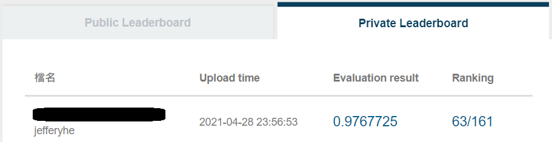
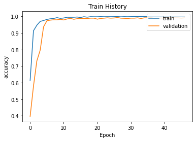
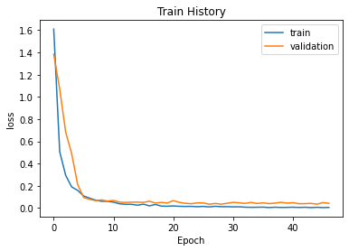
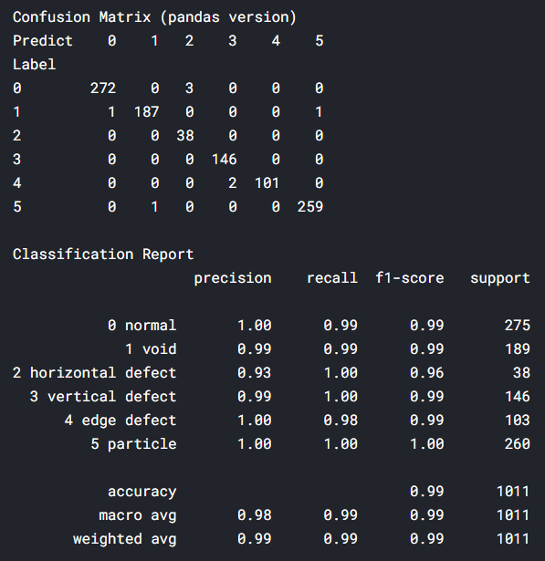

# 2021-AOI Defect Classification
a competition on AIdea Topic List
website: https://aidea-web.tw/topic/252eb73e-78d0-4024-8937-40ed20187fd8

### Private Evaluation result

#### Model
DenseNet

#### Technique
Data Augmentation、Class Reweight、Reduce Learning Rate、Early Stopping

#### Train history

#### Validation Confusion Matrix
